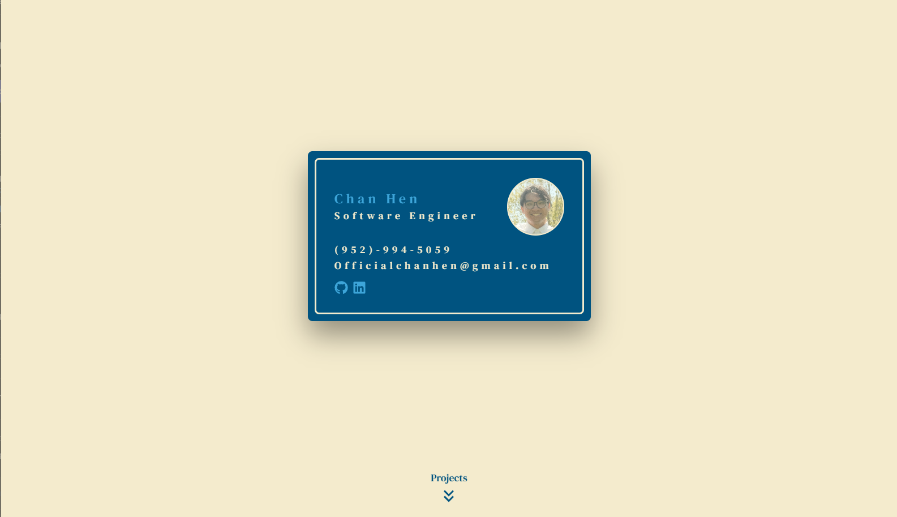

# Portfolio v1 (Legacy)

My first personal portfolio website — a static page built to showcase my projects and resume early in my development journey.

🔗 **[View Live](https://portfolio-five-blue.vercel.app/)**

---

## About

This is the original version of my portfolio, built before I transitioned to my current stack. It served as a personal landing page featuring my projects, skills, and a link to my resume. Kept online as a legacy reference.

---

## Features

- **Project showcase** — highlights personal and academic projects with descriptions and links
- **Resume section** — direct access to download or view my resume
- **Clean single-page layout** — everything accessible from one scroll

---

## Built With

- [React](https://react.dev)
- [Next.js](https://nextjs.org)
- [Tailwind CSS](https://tailwindcss.com)
- [TypeScript](https://www.typescriptlang.org/)

---

## Deployment

Deployed and hosted on [Vercel](https://vercel.com).

---

## Notes

This is a legacy project and is no longer actively maintained. For my current portfolio, see my latest work.
